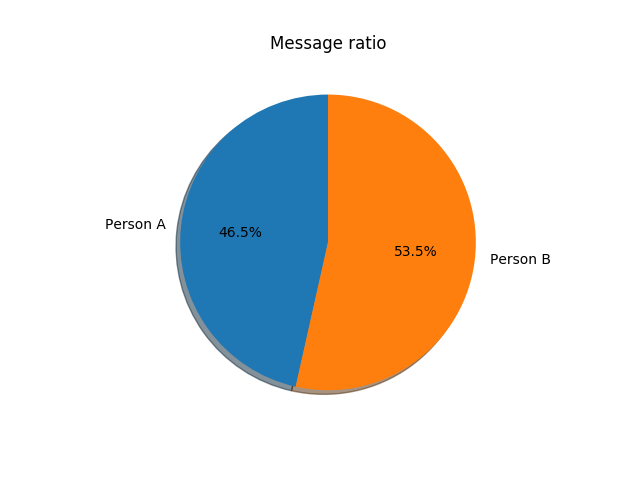
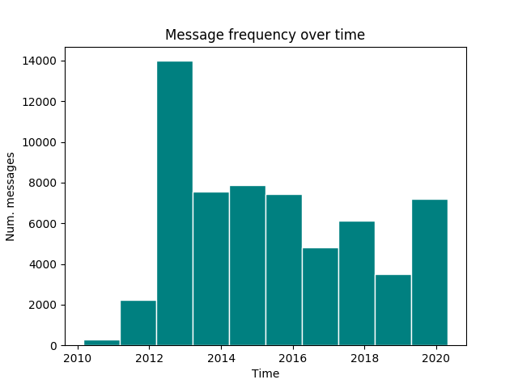

# Message analysis

## Message ratio

## Messages over time

## Frequent words
word | frequency
---- | ----
lol | 5124
shit | 1199
fucking | 1037
dude | 984
fuck | 914
good | 886
idk | 808
oh | 801
wtf | 795
think | 740

## Person A's frequent words
word | frequency
---- | ----
lol | 2776
shit | 877
fucking | 695
dude | 679
fuck | 638
ok | 533
idk | 473
wtf | 455
oh | 437
xd | 383

## Person B's frequent words
word | frequency
---- | ----
lol | 2348
good | 506
think | 457
time | 456
one | 382
oh | 364
really | 346
fucking | 342
wtf | 340
idk | 335
