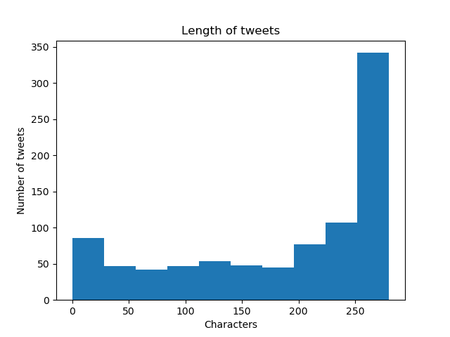

# _Twitter User_
### Lightweight, naive analysis of twitter data on one handle.





For one user, this lightweight analysis provides:

* Retweets vs native tweets bar plot
* Tweet time (hour) histogram
* Tweet length histogram
* 3-line timeseries of number of tweets over time, favorites/tweet over time, retweets/tweet over time.
* A csv file with word frequencies.

It also provides:

* A json file with all tweet attributes available in the [twitter API](https://developer.twitter.com/en/docs/tweets/data-dictionary/overview/tweet-object) 
* A csv file with various columns per tweet, such as its post datetime, hashtags, where it quoted/retweeted another tweet, its length, etc. 

Notes: 

* Word frequencies use standard nlp preprocessing procedures, such as stopword removal and non-ASCII removal.

* The processing module removes all non-ASCII characters, so tweets with a lot of unicode will not have an accurate result for word frequencies. 

  

Required libraries:

Install with: `pip install -r requirements.txt`

Non-standard libraries are: `nltk`, `tqdm`, and `tweepy`. 

Note: After downloading `nltk`, you will need to open a `python` console and run:
```python
import nltk
nltk.download('stopwords')
nltk.download('wordnet')
```